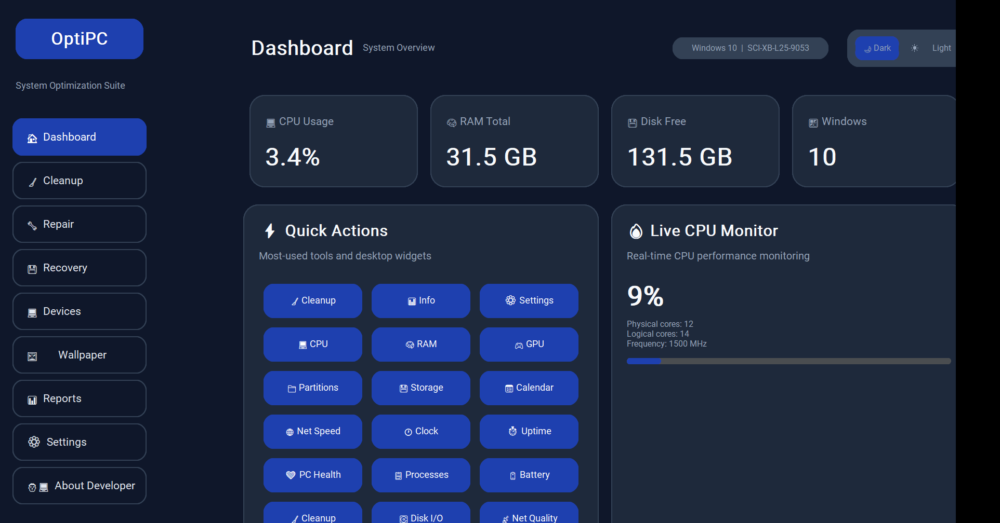
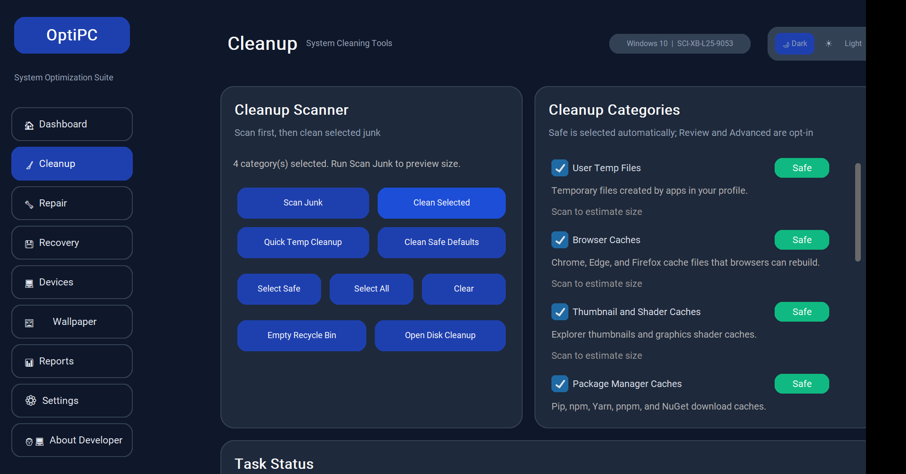
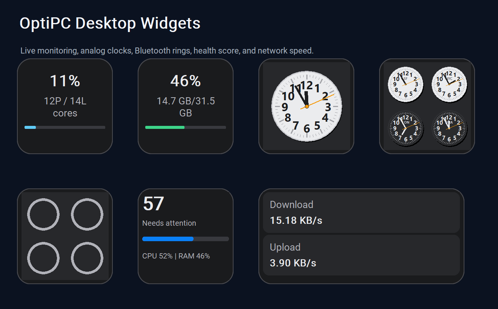
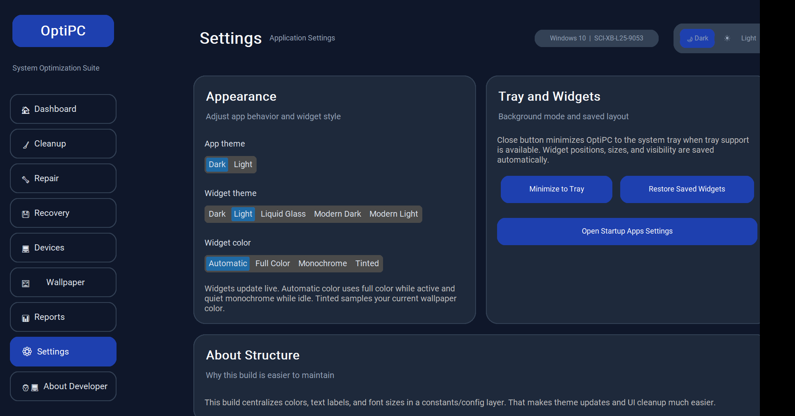

# OptiPC

OptiPC is a Windows system optimization suite for cleanup, repair, recovery shortcuts, device tools, reporting, and live desktop widgets. It is built with Python and CustomTkinter, packaged as a portable Windows executable.

The goal is simple: give normal Windows users one calm dashboard for the maintenance tasks they usually have to hunt for across Settings, Control Panel, Disk Cleanup, Task Manager, and command-line tools.

## Screenshots

### Dashboard



### Cleanup Scanner



### Desktop Widgets



### Settings



## What OptiPC Does

OptiPC combines these PC maintenance areas in one app:

- Dashboard with system overview, quick actions, and widget launchers.
- Cleanup scanner with size preview, category selection, and safe defaults.
- Repair shortcuts for Windows health tools such as SFC, DISM, and CHKDSK.
- Recovery page that opens Windows recovery utilities from a simpler interface.
- Device and privacy shortcuts for audio, camera, location, Bluetooth, and Windows settings.
- Wallpaper and appearance tools.
- Reports for system, battery, storage, and PC health context.
- Floating desktop widgets for live monitoring.
- System tray mode with saved widget layout.

## Cleanup Features

The cleanup page is designed to scan before deleting. It estimates reclaimable storage, shows item counts, separates categories by safety level, and lets the user choose what to clean.

Safe categories selected by default:

- User temporary files
- Browser caches for Chrome, Edge, and Firefox
- Thumbnail and shader caches
- Package manager caches for pip, npm, Yarn, pnpm, and NuGet

Review or advanced categories are opt-in:

- Windows temp files
- Windows Update and Delivery Optimization cache
- Crash reports and dump files
- Recent items shortcuts
- Installer leftovers

Locked files and protected admin paths can be skipped safely. Cleanup reports removed items, skipped items, failures, and bytes freed.

## Desktop Widgets

Widgets are built around standard size classes and shared theme tokens so they stay consistent across displays:

| Size class | Default size |
| --- | --- |
| Small | 170 x 170 |
| Medium | 364 x 170 |
| Large | 364 x 376 |
| Extra large | 745 x 376 |

Available widgets include:

- CPU usage
- Memory usage
- GPU status
- Storage and partitions
- Calendar
- Digital clock
- Analog clock
- World clock
- Uptime
- Internet speed
- PC health score
- Top processes
- Battery health
- Storage cleanup
- Disk I/O
- Network quality
- Bluetooth battery/status rings
- Windows Update status
- Temperature, when hardware sensors expose data
- Quick actions
- Performance timeline

Widget behavior:

- Drag to reposition.
- Resize from the edges and corners.
- Double-click to switch between compact and expanded layout where supported.
- Right-click for widget actions.
- Press and hold to enter edit mode with Apple-style remove controls.
- Hidden widgets pause expensive polling to reduce CPU usage.
- Positions, sizes, visibility, theme, and widget color mode are saved.

World Clock can be configured from the widget context menu. Use a preset or choose cities manually; the widget stores city/time-zone selections through the widget state service.

Bluetooth rings are status slots. When no supported battery-reporting Bluetooth device is connected, rings remain empty instead of inventing fake battery levels.

## Appearance

The main app supports dark and light modes. Widgets support:

- Dark
- Light
- Liquid Glass
- Modern Dark
- Modern Light
- Automatic color mode
- Full color
- Monochrome
- Tinted mode

The app uses shared widget color, typography, and sizing configuration so CPU, RAM, clocks, Bluetooth, calendar, and health widgets follow the same design language.

## Download And Run

The current ready-to-run build is the x64 Windows release:

- [OptiPC_x64_Release.zip](builds/OptiPC_x64_Release.zip)

Run it like this:

1. Download or open the release ZIP.
2. Extract the ZIP.
3. Double-click `OptiPC_x64.exe`.
4. Approve Windows security prompts only when you trust the local build.

The app is portable. It does not require a full installer. Some repair and cleanup actions may ask for administrator permission because Windows protects system folders and repair tools.

x86 and ARM64 spec files exist, but those builds should be produced and tested on real x86 or ARM64 Windows devices before release.

## Run From Source

Requirements:

- Windows 10 or Windows 11
- Python 3.10 or newer recommended
- PowerShell for Windows system commands

```powershell
python -m venv .venv
.\.venv\Scripts\Activate.ps1
pip install -r requirements.txt
python main.py
```

Dependencies are intentionally small:

- `customtkinter`
- `psutil`
- `GPUtil`
- `pystray`
- `Pillow`

## Build

Build the x64 executable:

```powershell
python build_multi_arch.py --arch x64
```

Build all supported targets where the host machine can produce them:

```powershell
python build_multi_arch.py --all
```

The generated executable is written to `dist/`. Release ZIPs are written to `builds/`.

## Test

Useful local checks:

```powershell
python test_responsive_design.py
python test_resize_fix.py
python test_resize_conflict_fix.py
python test_double_click.py
python test_close_button_double_click.py
python test_calendar.py
python test_new_widgets.py
```

For release QA, click through the built executable:

- Open app
- Open each page from the sidebar
- Run cleanup scan without deleting
- Test safe cleanup on disposable junk only
- Open, drag, resize, close, and restore widgets
- Switch widget themes and color modes
- Minimize to tray and restore
- Export or view reports

## Resource Use

Recent local x64 build size:

- `dist/OptiPC_x64.exe`: about 32.6 MB
- `builds/OptiPC_x64_Release.zip`: about 32.3 MB

Runtime usage depends on how many widgets are visible. The app is optimized to stay quiet when idle by:

- Throttling expensive hardware probes
- Sampling CPU instead of polling aggressively
- Pausing hidden widgets
- Caching slow status checks
- Avoiding fake Bluetooth battery scans when no supported device is connected

## Project Structure

```text
OptiPC/
  app.py                     Main application shell
  main.py                    Source entry point
  pages/                     Dashboard, cleanup, repair, recovery, settings, reports
  services/                  Cleanup, system, tray, settings, reports, widget state
  widgets/                   Floating desktop widgets and shared widget bases
  config/                    App constants, themes, widget specs, style tokens
  assets/                    App icon and README screenshots
  builds/                    Release ZIP output
  dist/                      Built executable output
```

## Safety And Privacy

OptiPC is a local Windows utility. It does not require an account and does not send PC data to a cloud service. Cleanup is category based and conservative by default, but any system cleanup tool can remove files the user may still want, so scan results should be reviewed before deleting.

OptiPC is not a replacement for antivirus software, backups, or professional data recovery tools.

## Current Limits

- Real acrylic or CSS-style blur is limited by the CustomTkinter/Tk stack.
- Temperature and battery wear can show unavailable when hardware or drivers do not expose sensor data.
- Pending Windows Update detection is limited compared with the full Windows Update Settings app.
- x86 and ARM64 builds need native-device QA before being advertised as ready releases.
